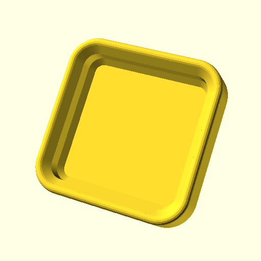
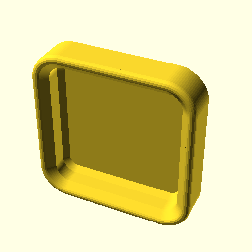
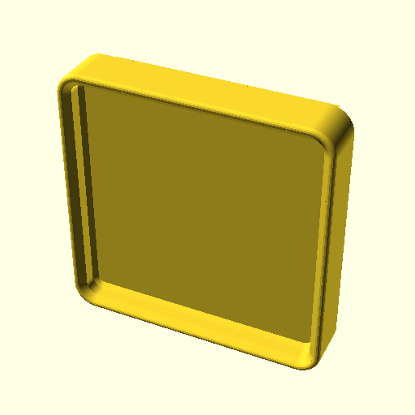

# Keycaps

FR, GF, and MF profile keycaps keep the tradition of 2 or 3 character alphanumeric names for keycap profiles and are designed to fit with [gridfinity-keyswitch-bins](https://github.com/dennisleexyz/gridfinity-keyboard-parts) when attached to a switch. Select which switches to target and the cap dimensions will update. For example, selecting

```openscad
supported = [mx, choc_v2];
```

will result in a shorter cap than selecting

```openscad
supported = [mx];
```

Customize width and height parametrically.
- [ ] TODO: only rectangular for now, sorry ISO enter and BAE lovers).
- [ ] TODO: stabilizers are not yet supported.

|  |  |
|----------------------------|---------------------------------|

```openscad
// keycap width (cherry: 18, choc: 17.5)
keycw = 18;
// keycap height (cherry: 18, choc: 16.5)
keych = 18;
size = [1, 1];
```

Stem tolerance requirement changes between materials, printer, etc. Here's some values found to work well:

- Bambu Lab P1S
- 0.4 mm Stainless Steel Nozzle
- Bambu Textured PEI Plate

| Filament                   | `Tol` (flat) | `Tol` (rotated) |
|----------------------------|--------------|-----------------|
| Overture Matte PLA White   | 0.05         | 0.1             |
| Bambu Lab PLA Basic Orange | 0.05         |                 |
| 3D BEST-Q PCTG Clear       | 0.1          |                 |
 
The earlier tests were conducted with PCTG. After switching to PLA the seam became visible. I noticed OrcaSlicer's Scarf joint seam (beta) option and looked it up. After applying settings from [this guide](https://www.printables.com/model/783313-better-seams-an-orca-slicer-guide-to-using-scarf-s), seams almost vanished. However, I switched from 3 back to 2 Wall loops to stop my OrcaSlicer from crashing every time I sliced. I also restored all of the Line width settings back to Bambu's presets and went back to the Classic Wall generator when seams on three out of the four center corners of the stem cross caused caps to sit skewed. You might also like to make surface lines vertical (change the Infill direction to 90°) to be parallel to the direction of finger travel.

Out of all options in OrcaSlicer, setting Top surface pattern, Bottom surface pattern, Sparse infill pattern, and Internal solid infill pattern to Hilbert Curve yielded the best clarity with transparent filament.

TODO: currently the skirt height is set to the stem height, it should be changed to the switch's top housing height.

The stem on MX switches is 1.1mm thick horizontally and 1.3mm thick vertically. These keycaps are generated with symmetric stems, considering that the rest of the profile is symmetric. During testing, this was not found to cause fitment issues. Also, Choc v2 stems are symmetric, according to their datasheet. TODO: add the option for asymmetric stems, particularly for non-square caps.

A 5.5mm diameter stem was found to fit Outemu GTMX, Kailh BOX/Choc v2, and Gateron KS-33 Low Profile switches.

TODO: Kailh Choc v1/Mini, Gateron KS-27 Low Profile stems are not yet supported.

```openscad
// stem diameter
d = 5.5;
```

## Libraries

Modeled in OpenSCAD, but the `.scad` isn't available for Thingiverse Customizer or MakerWorld Parame
tric Model Maker due to lack of support from these tools for loading external library files. The full source is available for downloading and using locally with OpenSCAD Customizer.

These external libraries are required:

- [gridfinity-rebuilt-openscad](https://github.com/kennetek/gridfinity-rebuilt-openscad/)
- [key.scad](https://github.com/dennisleexyz/key.scad)

The file paths are set up to work with libraries in either this folder or [OpenSCAD library path](https://
en.wikibooks.org/wiki/OpenSCAD_User_Manual/Libraries).

## FR (Flat Rectangular) Profile

This is a geometrically simple profile. It aims to provide a nice big flat top surface for legends (which could be multi-material 3D printed). To save time/material and allow (with clear 3D printing) decent optical clarity for seeing the switch underneath, the tops are thin, but not so thin that JLC3DP complains. There is room to make it thicker for a weightier (by about 25%) keycap.

The corner radius is concentric with the outside radius of the gridfinity-keyswitch-bins.

## GF (Gridfinity) and MF (Minifinity) Profiles
 
These are generated using the excellent [gridfinity-rebuilt-openscad](https://github.com/kennetek/gridfinity-rebuilt-openscad/) by kennetek.

- GF: full-size Gridfinity (half-base bins for a 21×21mm spacing).
- MF: Gridfinity bin at 42% scale, the same size as Machenna56k's Minifinity.

Print these flat with the stem facing up (reduce stem tolerance) with normal(auto) Snug support or rotated standing up at 45°/90° (increase stem tolerance).

|  |  |  |  |
|----------------------------|----------------------------|----------------------------|----------------------------|

## MF (Minifinity) Profile

Up-facing caps can have the stacking lip removed to print flat without support.

```openscad
// how should the top lip act
style_lip = 2; //[0: Regular lip, 1:remove lip subtractively, 2: remove lip and retain height]
```

|  |  |
|-------------------------------|-----------------------------------|


The bin can also be set to face down (stem on the top side).

```openscad
orientation = "down"; // [up: Up, down: Down]
```

|  |  |
|------------------------------|----------------------------------|

The stem can be shortened for stackability, but this can sometimes make them prone to falling off.

```openscad
stackable = true;
```


TODO: multi-width caps (bigger than 1×1) are not yet supported. There's a 1-1.05mm gap between keycaps, but a 0.5mm gap between Gridfinity bins, which gets even smaller after scaling it down to less than half of its original dimensions. I tried changing the `scale` and the library's `BASE_TOP_DIMENSIONS` but was unsuccessful in getting things to behave in the desired manner.

Additionally, when facing down, the caps are too short to provide a deep enough cutout for switch's top housing clearance without cutting into the bases and leaving holes between them.

|  |  |
|----------------------------------|--------------------------------------|

For even numbers of bases, when facing up, the stem will be in the middle and interfere with stacking.


## License

[Stem generation parameters are from Pseudoku (Asymplex Designs) under GPL-3.0.](https://github.com/pseudoku/PseudoMakeMeKeyCapProfiles) Therefore, keycaps in this repository are under that license.

Copyright (C) 2025 Dennis Lee

This program is free software: you can redistribute it and/or modify it under the terms of the GNU General Public License as published by the Free Software Foundation, version 3.

This program is distributed in the hope that it will be useful, but WITHOUT ANY WARRANTY; without even the implied warranty of MERCHANTABILITY or FITNESS FOR A PARTICULAR PURPOSE. See the GNU General Public License for more details.

You should have received a copy of the GNU General Public License along with this program. If not, see <https://www.gnu.org/licenses/>. 
